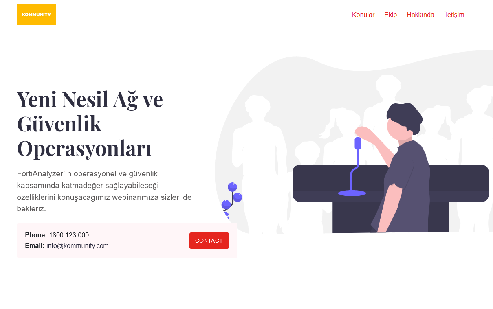
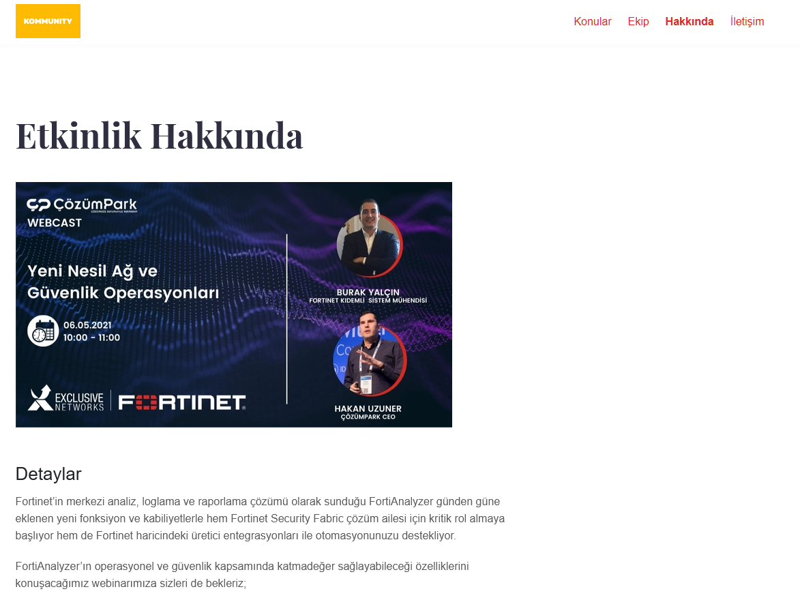
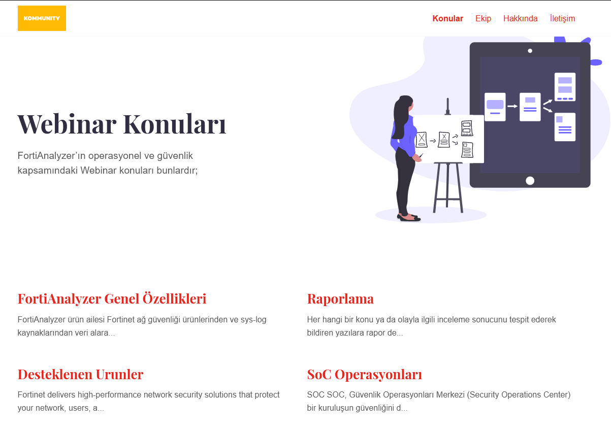
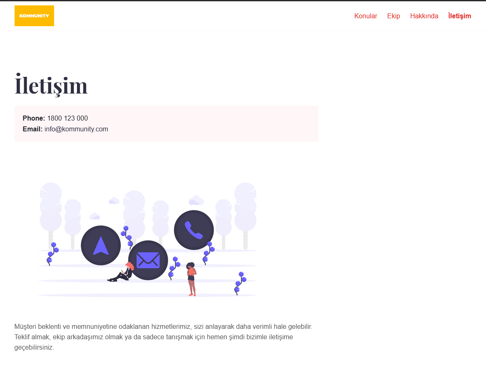

# Jekyll Etkinlik Ödevi

The Next Generation Network and Security Operations event held on the Kommunity platform was made for the "Internet Technologies" course.

[Live Demo](https://abdullahoztuurkk.github.io/) 

<p></img></p>
&nbsp;
<p></img></p>
&nbsp;
<p></img></p>
&nbsp;
<p></img></p>

## Installation

### Installing Ruby & Jekyll
 
If this is your first time using Jekyll, please follow the [Jekyll docs](https://jekyllrb.com/docs/installation/) and make sure your local environment (including Ruby) is setup correctly.

### Installing Theme

Download or clone the theme.

To run the theme locally, navigate to the theme directory and run:

```
bundle install
``` 

To start the Jekyll local development server.

```
bundle exec jekyll serve
``` 

To build the theme.
 
```
bundle exec jekyll build
```

## Other

### Credits

- Thank you to [ZeroStaticThemes](https://github.com/zerostaticthemes/) for this theme 
